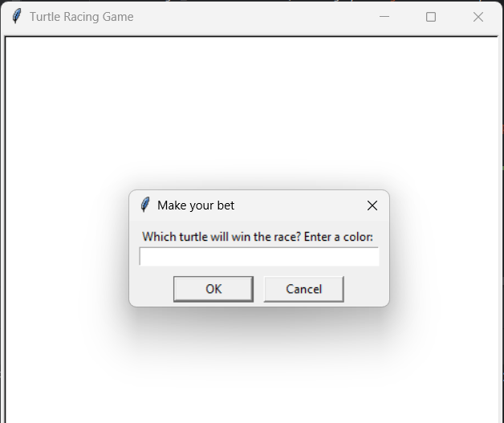
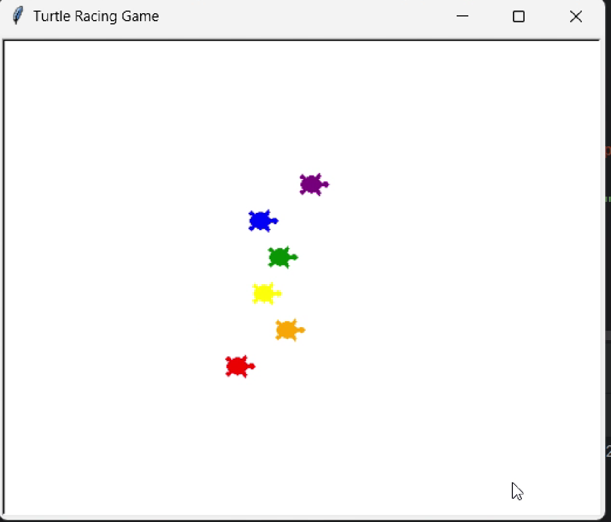
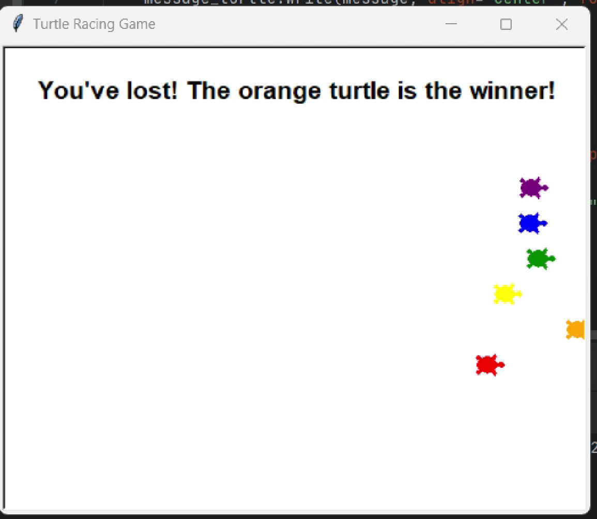

# Turtle Racing Game

## Introduction
The Turtle Racing Game is a fun and interactive Python game using the `turtle` module. In this game, you can place a bet on which turtle will win a race. Watch as colorful turtles race across the screen, and see if your chosen turtle emerges as the winner!

## Features
- **Multiple Turtles**: Race between 6 different turtles, each with a unique color.
- **User Interaction**: Place a bet on which turtle you think will win.
- **Real-Time Race**: Watch the turtles race in real-time with random movements.
- **Outcome Display**: Receive a message showing whether you won or lost based on your bet.

## How to Play
1. **Start the Game**: Run the Python script `turtle_racing_game.py`.
2. **Place Your Bet**: A prompt will ask you to enter the color of the turtle you believe will win the race.
3. **Watch the Race**: The turtles will begin racing across the screen.
4. **See the Result**: After the race ends, a message will appear informing you of the winner and whether your bet was successful.

## Screenshot
Below is a screenshot of the Turtle Racing Game in action:

## License
This project is licensed under the MIT License. See the [LICENSE](LICENSE) file for more details.

Feel free to customize and extend the game. Enjoy racing the turtles!

